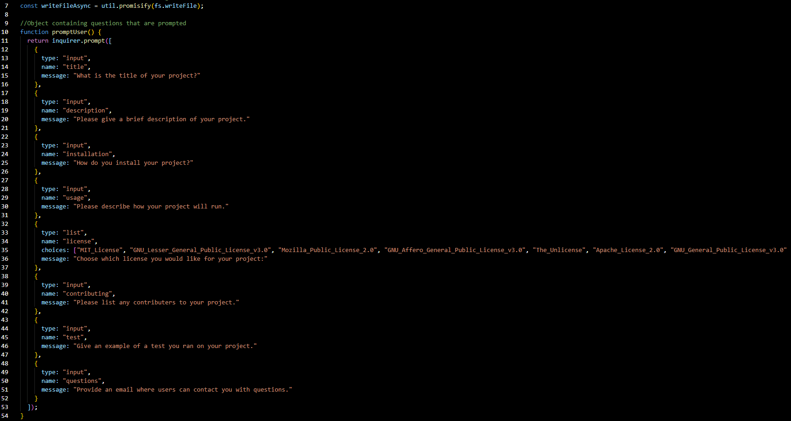
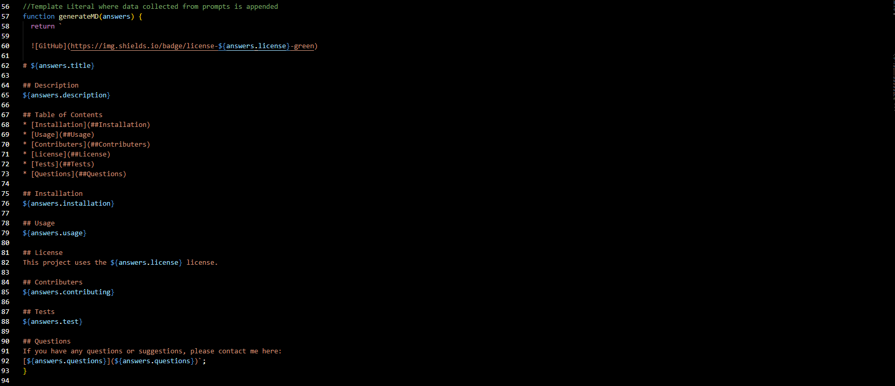

# README Generator

## Description

This application will generate a markdown file for the user. It is ran inside a command console. When the user initiates the index file (node index.js), they will be presented with a series of prompts. Once the data is collected from the user, it is apended to a template literal and a markdown file is generated.

## Credits

Javascript
Node
Visual Studio Code
Github

## Video

https://drive.google.com/file/d/1C3U6elJsnyOPjix6rnVJkDgFLZSg73x1/view?usp=sharing

## Screenshots

